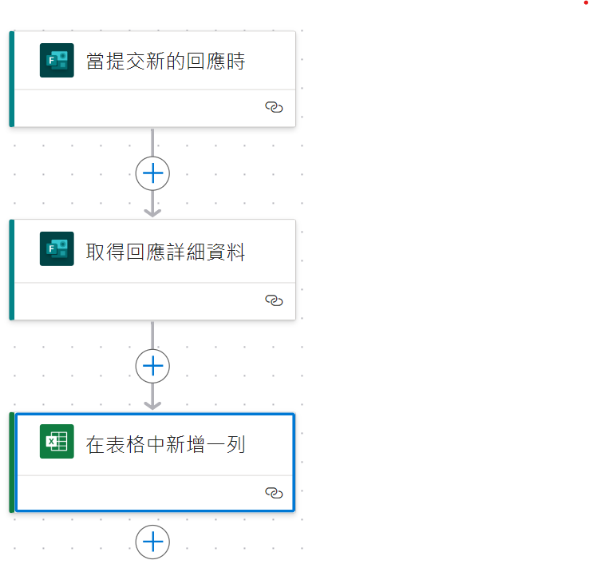

## Department Create Ticket to ITSM System

**In this code, you can easily automatically create tickets to the Company ITSM system according to daily user needs.**

### Environment setup
```
conda create -n azure python=3.10
conda activate azure
pip install azure-identity
pip install -r requirements.txt
```
### Configuration
```
touch config.ini
vim config.ini
```

```python
#Azure Storage Account Blob
[azure_config]
connectionString = <>

#Token by ITSM account
[headers]
Authorization = <>

#ITSM Variable
[Devops]
Workgroup = <>
Subcategory = <>
PrimaryCI = <>

[Cloud]
Workgroup = <>
Subcategory = <>
PrimaryCI = <>

[Data]
Workgroup = <>
Subcategory = <>
PrimaryCI = <>

#ITSM URL
[URL] 
PRD = <>
QA = <>

#ITSM Account
[Account]
username = <>
password = <>

#Microsoft account
[Sharepoint]
username = <>
password = <>
DepartmentSiteURL = <> #"https://xxxxxx.sharepoint.com/teams/MLxxxxxx/"
website = <> #"https://xxxxxx.sharepoint.com"
```
#### How to get connection string ？
1. Go to Azure Portal
2. Go to Storage Account
3. Go to Access Keys
4. Open the Azure cloud shell and run the following command
```bash
az storage account show-connection-string -n MyStorageAccount
```
5. Paste it in the config.py file
6. Done

## How to run ？
```bash
cd ITSM_Automation
python Department_create_ticket_api.py
```

## The script will do the following:
1. Download the ITSM_Form_Department.xlsx Info excel file from the Azure Storage Blob.
2. Extract the Api related data from the excel file.
3. Call Api with payloads(SubmitTimes, UserMails, UserNames, AdminNames, ProblemTitles, ProblemDescriptions, SolutionWays, Urgents)
4. Upload the file to the Sharepoint
5. Delete the yesterday file from the Sharepoint
6. Success

# Power Automate Describe
## ITSM Form to create Excel file
1. When the user completes the form
2. Automatically update latest replies to SharePoint
   



## ITSM Form to Blob
1. Automatically obtain SharePoint file content and update it to Blob
   


```
#!/usr/bin/python3
# _*_ coding: utf-8 _*_
#
# Copyright (C) 2024 Kent Huang, All Rights Reserved 
#
# @Time    : 2024/06/27
# @Author  : Kent Huang
# @File    : README.md
# @Project : ITSM_Automation
```
